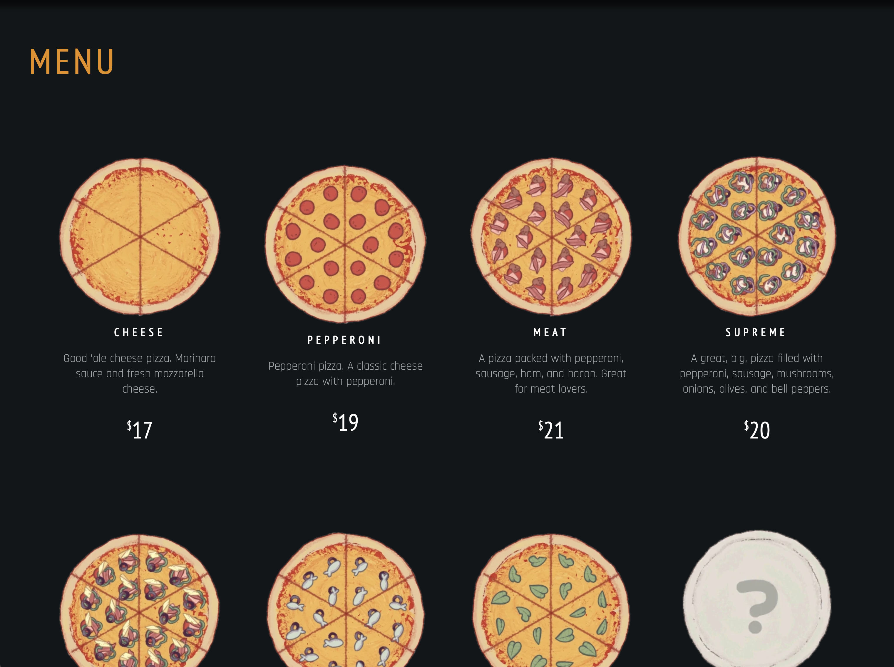
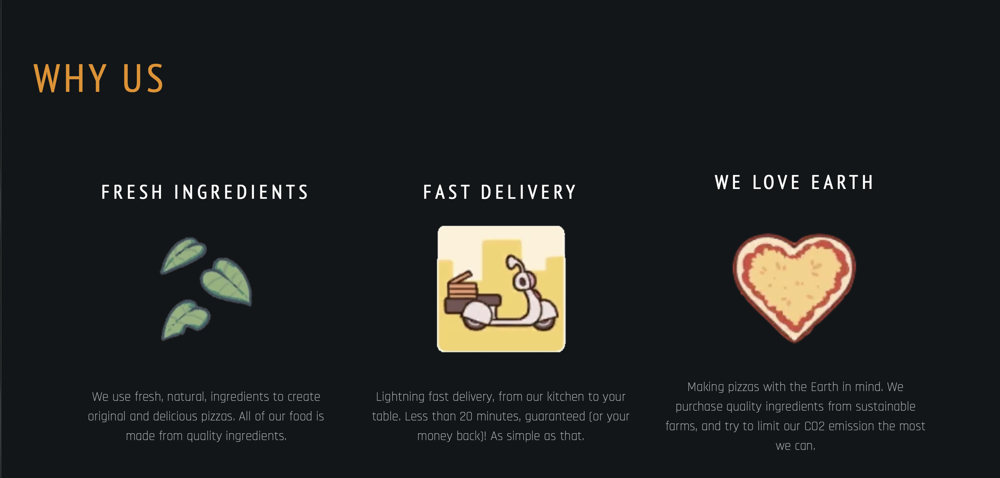
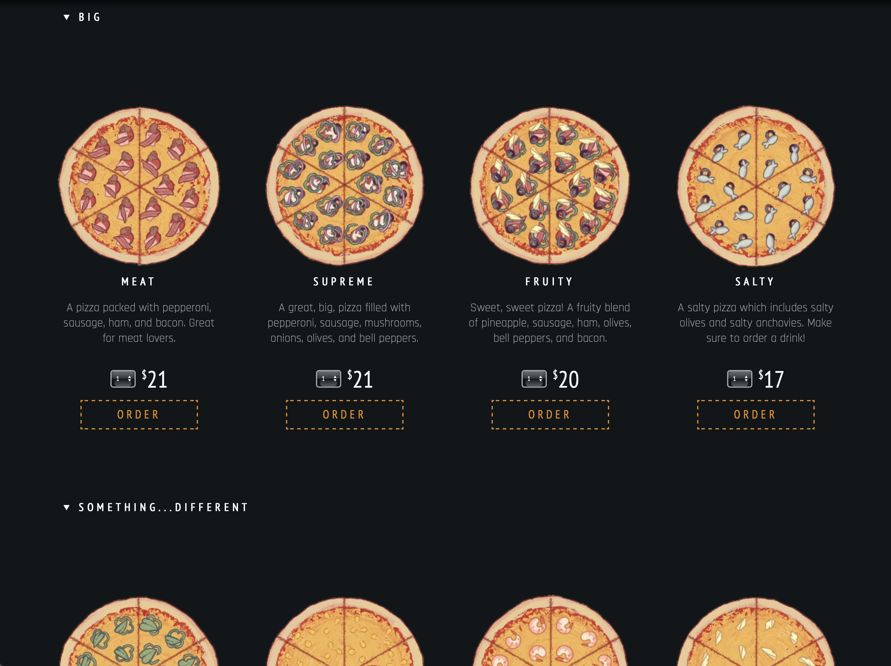
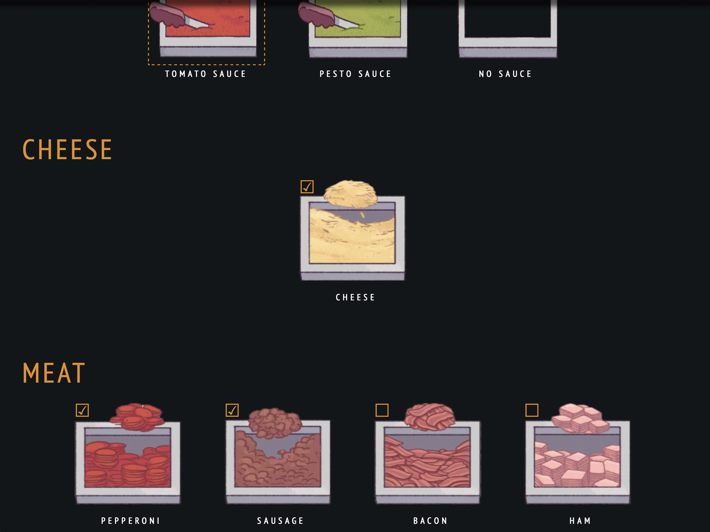
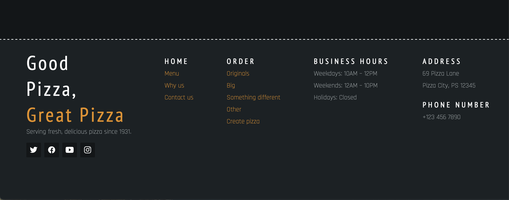
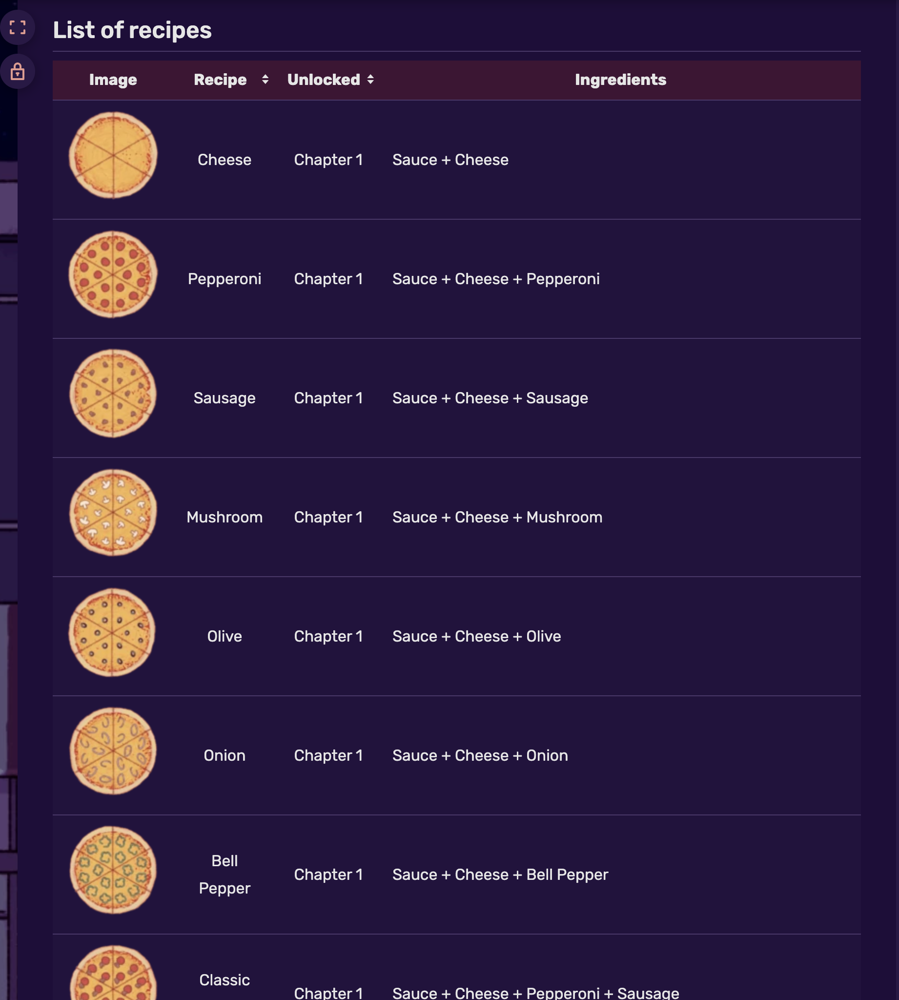
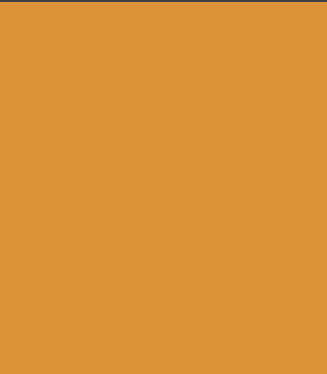
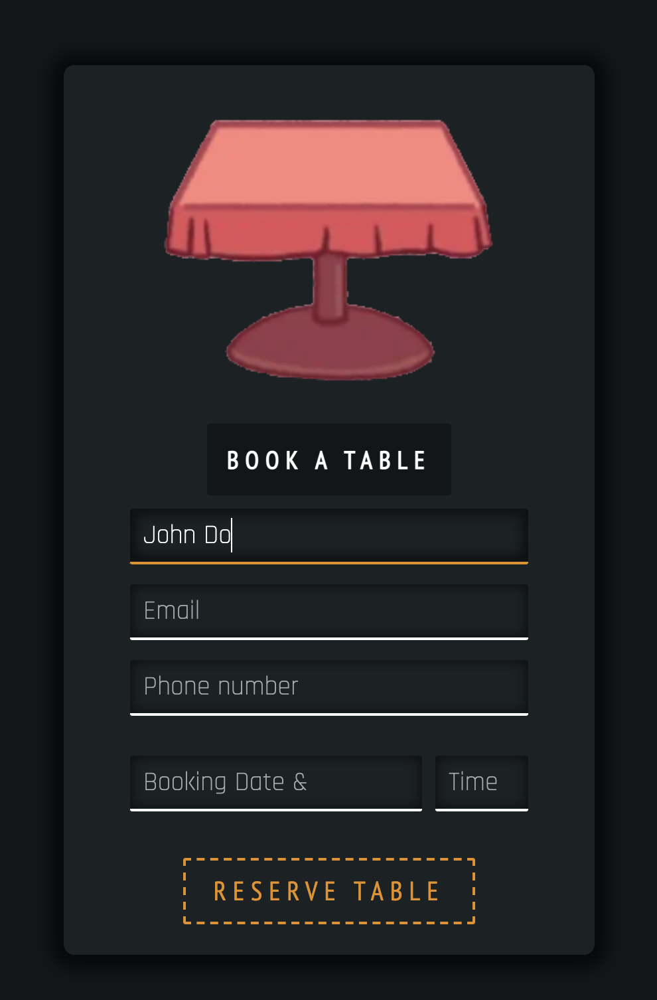
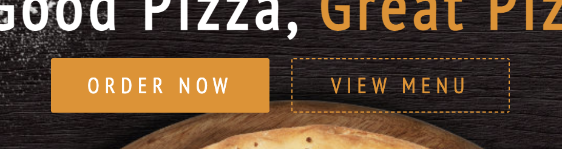
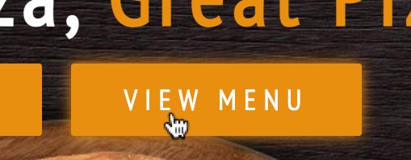

# Good Pizza Great Pizza – A pizza site! 🍕

# Hi!! 👋

Hope everyone is doing well! :)

# Do you want pizza? Hot, fresh, delicious, fast pizza? 

### In that case, *Good Pizza, Great Pizza* will deliver hot, fresh, delicious, fast pizza to your doorstep in less than 20 minutes!

###### This pizza site isn't an *actual* site for a real pizza company (calling the fake number, going to any of the fake social media, or showing up at the fake address will **not** result in hot, fresh, delicious, fast pizza!

***


Anyways!

I made a *responsive* pizza restaurant website in `HTML` and `CSS`!

Here's how it looks like: 


It's based on the video game [Good Pizza Great Pizza](https://www.goodpizzagreatpizza.com/), an awesome mobile pizza simulation game where you own a pizzeria, have different customers with orders, and have to prepare pizzas for them. Many of the images I used are from the game (I got the images on the [wiki](https://good-pizza-great-pizza.fandom.com/wiki/Good_Pizza,_Great_Pizza_Wiki)).

***

## Links 🔗

* [Site ==> Good-Pizza-Great-Pizza.bookie0.repl.co](https://Good-Pizza-Great-Pizza.bookie0.repl.co)

* [Code ==> replit.com/@Bookie0/Good-Pizza-Great-Pizza#README.md](https://replit.com/@Bookie0/Good-Pizza-Great-Pizza#README.md)

* [Spotlight/Apps page ==> replit.com/@Bookie0/Good-Pizza-Great-Pizza?v=1](https://replit.com/@Bookie0/Good-Pizza-Great-Pizza?v=1)

* [Post ==> replit.com/talk/share/Good-Pizza-Great-Pizza-A-pizza-site/145576](https://replit.com/talk/share/Good-Pizza-Great-Pizza-A-pizza-site/145576)


***

## Features ✨


**Home page/landing page**


- Hero image 
- Navbar
- 2 buttons (including 1 CTA)
- Small pizza slice image with bouncing animation (to indicate scroll down/click on it)

**Menu**



- 7 pizzas and 'Make your own' option
- Each with name, image, description, and price
- 'View our full menu' link

**Why us**



- 3 reasons why you should use this pizza restaurant
  - Fresh ingredients
  - Fast delivery
  - We love Earth
- Each with title, image, and description

**Contact**


- Business hours card with image, days, and hours
- Book a table card with image and form 
  - Name
  - Email 
  - Phone number
  - Booking date & time
  - 'Reserve table' button
- Street address
- Phone number

**Order**



- 5 categories:
  - Original
  - Big 
  - Something...different
  - Other
  - Create pizza
- Each pizza has name, image, description, price, quantity, and 'Order' button

**Create**



- 7 different ingredients to choose from:
  - Dough
  - Sauce
  - Cheese
  - Meat 
  - Veggies
  - Fruit
  - Other
- For dough and sauce, you can only select one
- For the rest, you can check the ones you want

**Footer**



- Name of restaurant, description
- Social media icons
- Links on home page
- Links on order page
- Business hours
- Address 
- Phone number

***

## Style 🎨


**Pizza images**

The pizza images (except for the hero image), all come from the game I mentioned above. 

As you can see, I found the images on the Fandom Wiki.



The images for the Why Us and Contact section also come from the Fandom

**Fonts**

The main font family is `font-family: 'Rajdhani', sans-serif;`, but I also used `font-family: 'PT Sans Narrow', sans-serif;` for the text in caps (as well as `letter-spacing: 5px;` to not make it too aggressive/bunched up).

**Icons**

The social media icons on the footer come from [Ionicons](https://ionic.io/ionicons), a great library of beautiful icons.

**Colors**

The primary color is `#121618`, used for the background color, a nice black that's not too dark. The secondary color, mostly used for the cards and footer, is `#1b2124`. The accent color, `#e98f0f` is a sort of yellow-dark-orange color. It looks great because the color ressembles colors found in pizzas. The accent color is used for buttons, CTA elements, headers, and highlights.

This is how it looks like: 



For the text, the primary text color is a simple white: `#fff`. The secondary color is #a3abad`, a gray.


**Reservation form**

I just wanted to go through a bit on what I did for the reservation form (particularly the input boxes):



The input boxes have a transparent background color, and a white bottom border. They also seem to have a black-ish border on the other sides, but it's actually a shadow! With `box-shadow: 0 0 8px 2px inset rgba(0 0 0 / 50%)`, we use `inset` on the `box-shadow` property so that it makes the input box look a bit hollow. It's a pretty cool effect!

Then, when you click on the input box to type something in it (`:focus` pseudo class), the bottom border switches to the yellow/orange accent color, and the shadow effect is a bit darker (as if you're 'pressing' more into the input box).

Here's the `CSS` for the form:

```css
.contact .container .card.book input {
	border-radius: 2px; /* make it a bit round, but not too much */
	border: none; /* no border... */
	border-bottom: 2px solid var(--primary-text-color); /* except bottom border */
	width: 300px; /* dimensions */
	height: 30px;
	background-color: transparent; /* no background color */
	font-family: 'Rajdhani', sans-serif; /* font family */
	font-size: 20px; /* how big the text is */
	margin-bottom: 15px; /* to space the input boxes out from each other */
	color: var(--primary-text-color); /* color of text you type in */
	padding: 20px; /* spacing between content and border */
	padding-left: 10px; /* less padding on the left */
	transition-duration: 0.3s; /* to make a smooth transition between different colors */
	box-shadow: 0 0 8px 2px inset rgba(0 0 0 / 50%); /* box shadow to make it look hollow */
}
 
/* placeholder text (that disappears when you click on it */
.contact .container .card.book input::placeholder {
	color: var(--secondary-text-color); /* secondary text color */
}

/* when you click the input box */
.contact .container .card.book input:focus {
	outline: none; /* input boxes have a default outline */
	border-color: var(--accent-color); /* changes the bottom border to the accent color */
	box-shadow: 0 0 8px 5px inset rgba(0, 0, 0, 0.5) /* box shadow becomes a bit thicker */
}
```

**Buttons**

The buttons all share the same similar style. They have the accent color, dashed, border, a transparent background, and accent color text in full caps. On hover (`:hover`), that text becomes white, the border disappears, and the background color is the accent color. There's also an accent color shadow, to make it look like the button is glowing. When you click on the button (`:active`), it becomes bigger (`1.05` times bigger).

Here's how it was made:






```css
button {
	background-color: transparent; /* transparent background color (for most buttons) */
	border: 2px dashed var(--accent-color); /* dashed border */
	color: var(--accent-color); /* color of text */
	font-size: 20px; /* font size */ 
	width: 200px; /* dimensions */
	height: 50px;
	font-family: 'PT Sans Narrow', sans-serif; /* font family */
	letter-spacing: 5px; /* space between letters */
	margin-top: 10px; /* spacing above button */
	cursor: pointer;	/* to make the cursor pointer (when hovering) */
	transition: background 0.3s, color 0.3s, transform 0.1s; /* smooth transitions (different values for each property */
}

/* on hover */
button:hover {
	background: var(--accent-color); /* background color appears */
	color: var(--primary-text-color); /* different text color */
	box-shadow: 0 0 10px 0 var(--accent-color); /* shadow */
}

/* on click */
button:active {
	transform: scale(1.05); /* buttons gets bigger */
}
```

### If you'd like to know more about the design or style of the site in general, check out [the code](https://replit.com/@Bookie0/Good-Pizza-Great-Pizza#README.md), or tell me in the comments! :) 

***

## Closing 🚪

Well, that's about all! Make sure to let me know any comments, suggestions, or questions if you have them! :D 

### Have a great day!!!

# Bye! 👋
